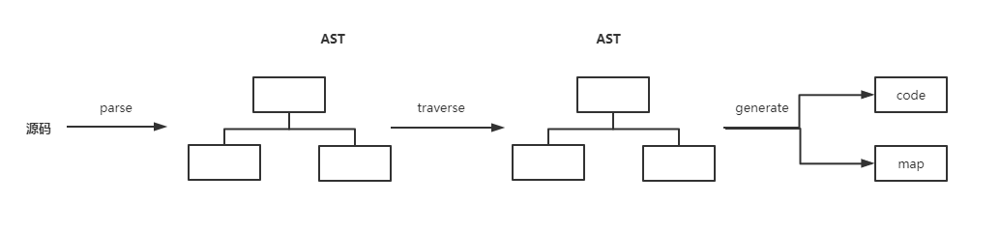
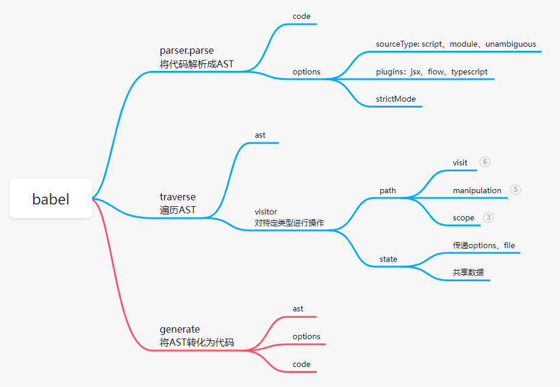
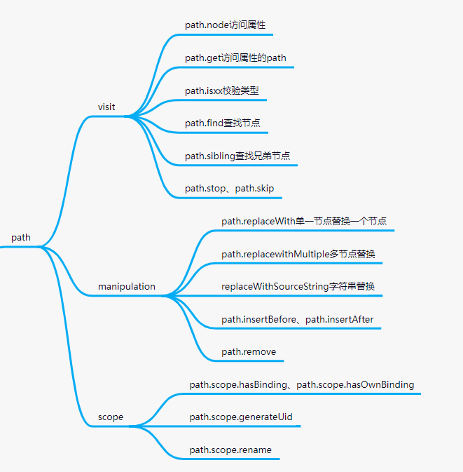

# babel

`babel` 是 `compiler`，主要用来将 `ES Next` 语法编写的代码转化为目标环境的代码。

可以做以下工作：

- 语法转换
- 通过 `Polyfill` 方式在目标环境中添加缺失的特性 （通过引入第三方 `polyfill` 模块，例如 `core-js`）
- 源码转换（`codemods`）
- 其他（信息读取、代码压缩等）

## 工作流程



首先将字符串解析成 `ast`，然后对 `ast` 进行需要的转化，最后将转化后的 `ast` 生成字符串及 `source map`。

工作流中使用的API：



`path` 相关API：



## plugin

`plugin` 是配置 `babel` 的核心，通过遍历 `AST` 的节点类型来实现我们需要的功能。

`plugin` 既可以是函数，也可以是对象。为函数时，接收配置数组中的 `options` 作为参数传入。

函数格式：

``` js
function(api, options, dirname) {
  return {
    inherits: parentPlugin,
    manipulateOptions(options, parserOptions) {
        // ...
    },
    pre(file) {
      this.cache = new Map();
    },
    visitor: {
      StringLiteral(path, state) {
        this.cache.set(path.node.value, 1);
      }
    },
    post(file) {
      console.log(this.cache);
    }
  };
} 
```

接收 3 个参数：`api`、`options`、`dirname`。

- `api`: `babel` 的 `api`，比如 `types`、`template` 等。
- `options`: 配置文件中传入的参数
- `dirname`: 目录名

返回的对象有 `inherits`、`manipulateOptions`、`pre`、`visitor`、`post` 等属性。

- `inherits` 指定继承某个插件，通过 `Object.assign` 和当前插件的 `options` 合并。
- `visitor` 指定 `traverse` 时调用的函数。
- `pre` 和 `post` 分别在遍历前后调用，可以做一些插件调用前后的逻辑。
- `manipulateOptions` 用于修改 `options`，是在插件里面修改配置的方式。

> [单测](https://github.com/jamiebuilds/babel-handbook/blob/master/translations/en/plugin-handbook.md#unit-testing)

`preset` 是对多个 `plugin` 和 `preset` 的封装，当配置文件中有多个`preset` 和 `plugin` 时，执行顺序为：**先从左往右执行 plugin， 再从右往左执行preset**。

## 参考

- 节点类型: [AST Node Types](https://github.com/babel/babel/blob/main/packages/babel-parser/ast/spec.md)
- 小型编译器：[the-super-tiny-compiler](https://github.com/thejameskyle/the-super-tiny-compiler)
- AST探索：[astexplorer.net](https://astexplorer.net/#/KJ8AjD6maa)
- 插件手册：[generator-babel-plugin](https://github.com/babel/generator-babel-plugin)